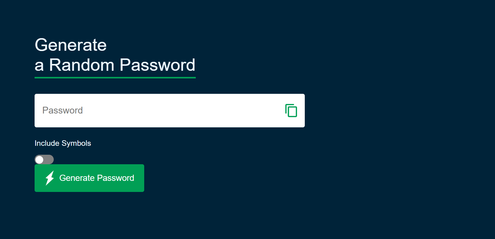

# 🔐 Advanced Password Generator

A robust password generator built with **HTML5**, **CSS3**, and **Modern JavaScript**.

  
*Live demo: [Try it here](https://nkwili.github.io/passwort-generator/)*  

## 🚀 Features

### 🔧 Core Functionality
- **Custom Length (8-64 characters)** with dynamic slider
- **Multi-character Set Support**: 
  - Upper/lowercase letters
  - Numbers (0-9)
  - Special symbols (!@#$%^&*)
- **One-Click Copy** with visual feedback
- **Strength Indicator** based on complexity

### 🛠 Advanced Features
- **Smart Exclusion Rules**:
  - Similar characters (e.g., l, 1, I)
  - Ambiguous symbols
- **Password History** (Last 10 generated):
  - Local Storage persistence
  - Click-to-copy functionality
  - **Bold CSS text** for better visibility
- **Offline First**:
  - Network status detection
  - Graceful degradation
  - Cache-first strategy

## 🛠 Tech Stack

**Frontend**  

**Tooling**  

## 📦 Installation & Usage

# Clone repository
git clone https://github.com/NKWILI/passwort-generator.git
cd password-manager

**Browser Instructions**:
1. Enable clipboard permissions when prompted
2. Adjust security settings if needed for local storage
3. Toggle options using the control panel
4. Click "Generate" to create new passwords

## 📚 Learning Outcomes

- **Advanced DOM Manipulation**:
  - Dynamic element creation
  - Performance optimization

- **State Management**:
  - Local Storage integration
  - Session persistence
  - Data validation

## 📜 License

This project is licensed under the MIT License - see the [LICENSE](LICENSE) file for details.

**Architected with** ❤️ **by Alain Nkw**  

